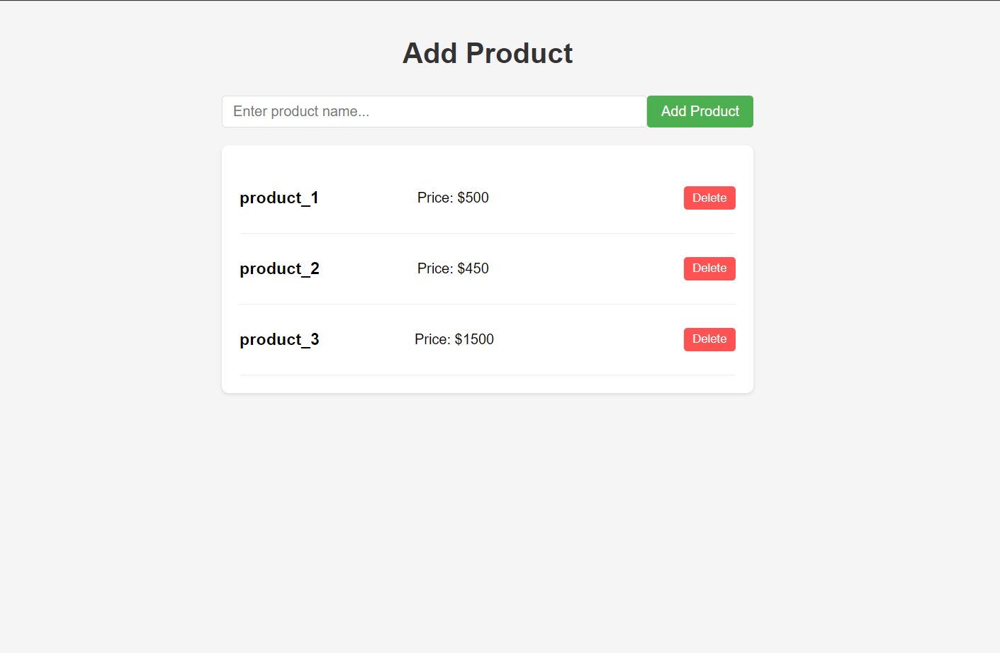

Simple Shopping Cart with JavaScript 🛒
A beginner-friendly shopping cart implementation with:
✔ Add/Delete products
✔ Persistent storage (using localStorage)
✔ Clean, modern UI
✔ Vanilla JavaScript (no frameworks)

![Shopping Cart Preview]

Features ✨
Add products with name, price, and description

Delete products with one click

Data persists on page refresh (thanks to localStorage)

Responsive design that works on mobile & desktop

Sleek UI with hover effects and smooth transitions

How to Use 🚀
Clone the repo:

bash
git clone https://github.com/your-username/simple-shopping-cart.git
Open index.html in your browser

Try it out:

Type a product name and click "Add Product"

Products save automatically (refresh to test!)

Click the red trash button to delete items

Code Structure 📁
text
simple-shopping-cart/
├── index.html          # Main HTML with improved UI
├── style.css          # All the styling (flexbox, hover effects)
└── script.js          # Core logic (add/delete/save to localStorage)

javascript
// Save to browser storage
localStorage.setItem('products', JSON.stringify(products));
UI:

Clean white card layout

Hover effects on buttons

Input field highlighting

Error Handling

Prevents empty product names
